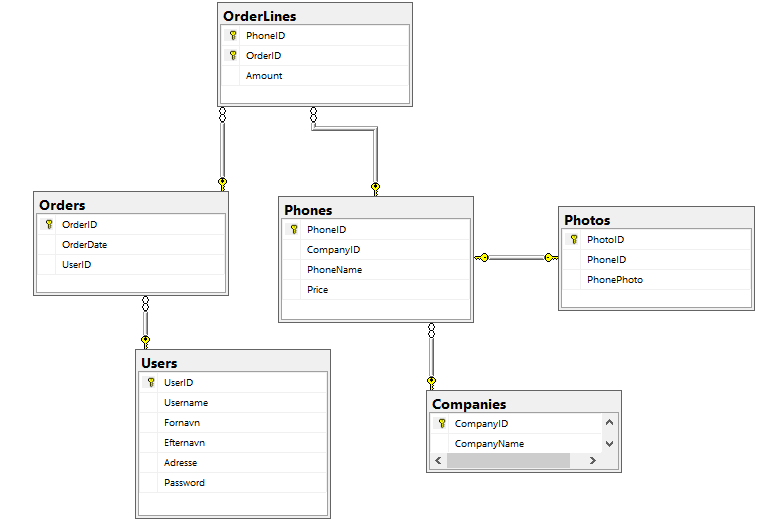
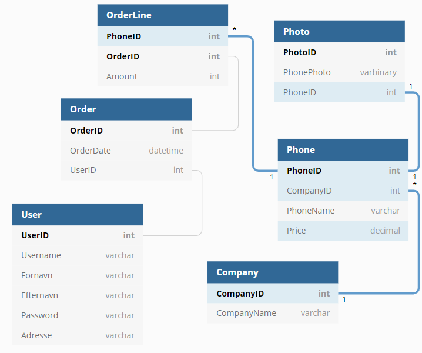

# eShop Projekt Kenneth Jessen
## Diagrammer

#### DataBase diagrammet:

 

#### ER diagrammet:

 

## Opgave
### Web App og WebAPI
- [x] Der benyttes Tag Helpers alle steder, hvor det er relevant
- [x] Layout-filen er stylet og tilpasset med passende navigation, top og footer
- [x] Der benyttes et eller flere Partial Views
- [x] Der benyttes View Component
- [x] En eller flere Select controller benyttes og er "befolket" på en god måde
- [x] Der er taget skridt til at ungå "over posting" ved at benytte ViewModel klasser hvor det er relevant
- [x] Der ingår funktionaliteter som Filtering, Ordering og Paging
- [x] Alle brugerinput er valideret med passende fejlmeddelelser
- [x] Et eller flere eksempler på Custom Handler Method
- [x] Overholdelse af POST-REDIRECT-GET design pattern
- [x] Routing er tilpasset med constraint, hvor det er relevant
- [x] Anvendt forskellige former for State Management, f.eks. Cookies, TempData, Session Variable og Caching
- [ ] Applikationen er klargjort til deployment (Minifying og Bundling, Enviornment osv.)
- [ ] Applikation er deplpoyet on-premise
- [x] Der er lavet et WebAPI med passende URL´s til at tilgå ressourcerne
- [ ] ~~Der er taget hensyn til at de hentede objekter fra WevAPI´et skal kunne benyttes af JavaScript kode~~
- [ ] Swagger er konfigureret og anvendt

#### Optionelle krav der vedrører Web App og WebAPI
- [ ] Opret en custom Tag Helper og benyt den i et View
- [x] Alle metodekald til ServiceLayer er asynkrone (De fleste er)
- [x] Brug Bootstrap 4 til at fremhæve kontroller med fejl
- [ ] En udbygget brug af Identity, som f.eks. mulighed for at nulstille password, email bekræftelse og roller.
- [ ] Der er indbygget Logging af alle transaktioner samt fejl.
- [ ] Anvendelse af Identity til brugeroprettelse og authentication.

 

### Funktionelle krav til applikationen
#### A. Krav til forsiden
- [x] Forsiden viser et antal produkter med et billede af hver, prisen, navn og en knap til at lægge varen i kurven
- [x] Der benyttes Paging således at forsiden kun viser et bestemt antal produkter ad gangen. Man kan se at der evt. er flere produkter (<strong>Paging foregår ikke på Index siden men Admin siden</strong>)
- [x] Der er mulighed for at søge på "Brand" og på "Type" eller lignende
- [x] Der er også fritekst-søgning
- [x] Der er mulighed for stigende og faldende sortering
- [x] Der vises et ikon med en varekurv og et antal varer i kurven. Klikkes på ikonet, vises varekurven
- [x] Lægges en vare i kurven, vises den opdaterede varekurv

#### B. Krav til varekurven
- [x] Varekurven viser en opdateret liste af valgte produkter, med billede, navn, styk-pris, antal (skal kunne ændres) samt linjepriseen. (<strong>Antal kan ikke ændres fra selve kurven</strong>*Endnu*)
- [ ] Der skal være en Update knap, som opdaterer priserne hvis man ændrer antallet.
- [x] Det skal være muligt at fjerne et produkt fra varekurven, hvis man fortryder valget
- [ ] Der skal være en Checkout knap, som fører til Checkout-siden
- [x] Der skal være en knap, der giver mulighed for at fortsætte med at handle, inden man går til checkout (**Der er ingen bestemt kurv side, kurven bliver vist i en modal (popup)**)

#### C. Krav til checkout
- [ ] Brugeren skal afgive oplysninger om email, navn, adresse, valg af betalingsmiddel og forsendelse
- [ ] Når brugeren trykke på Køb knappen, skal der udsendes en mail som bekræftelse af købet

### Optionelle krav til applikationen
- [ ] Forsiden viser "featured" produkter
- [x] Når musen passerer henover et billede af et produkt, fremhæves billedet (evt. med en skygge eller ramme)
- [ ] Mulighed for at logge ind, f.eks. når man går til Checkout. 
- [ ] Hvis brugeren er logget ind, slipper brugeren for at registrere sig igen
- [ ] Når brugeren er logget ind, vises produkter som anses for at være interessante for netop denne kunde, baseret på en profil
- [x] En Admin side, der giver en administrator en liste over alle produkter og mulighed for at redigere produkterne.

### Andre krav til desing og implementation
- [x] Designet laves således at det opfylder best practice indenfor databasedesign
- [x] Der benyttes Entity Framework Core
- [ ] Der foretages en funktionstest, der viser at de funktionelle krav er opfyldt
