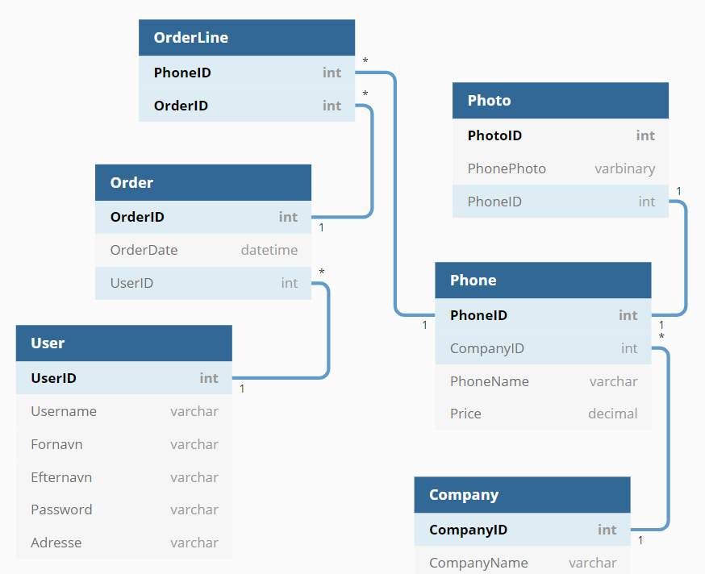

# eShop Projekt Kenneth Jessen
## Diagrammer

#### DataBase diagrammet:

 

#### ER diagrammet:

 

## Opgave

- [x] Der benyttes Tag Helpers alle steder, hvor det er relevant
- [x] Layout-filen er stylet og tilpasset med passende navigation, top og footer
- [x] Der benyttes et eller flere Partial Views
- [x] Der benyttes View Component
- [x] En eller flere Select controller benyttes og er "befolket" på en god måde
- [x] Der er taget skridt til at ungå "over posting" ved at benytte ViewModel klasser hvor det er relevant
- [x] Der ingår funktionaliteter som Filtering, Ordering og Paging
- [x] Alle brugerinput er valideret med passende fejlmeddelelser
- [x] Et eller flere eksempler på Custom Handler Method
- [x] Overholdelse af POST-REDIRECT-GET design pattern
- [x] Routing er tilpasset med constraint, hvor det er relevant
- [x] Anvendt forskellige former for State Management, f.eks. Cookies, TempData, Session Variable og Caching
- [ ] Applikationen er klargjort til deployment (Minifying og Bundling, Enviornment osv.)
- [ ] Applikation er deplpoyet on-premise
- [x] Der er lavet et WebAPI med passende URL´s til at tilgå ressourcerne
- [ ] ~~Der er taget hensyn til at de hentede objekter fra WevAPI´et skal kunne benyttes af JavaScript kode~~
- [ ] Swagger er konfigureret og anvendt
