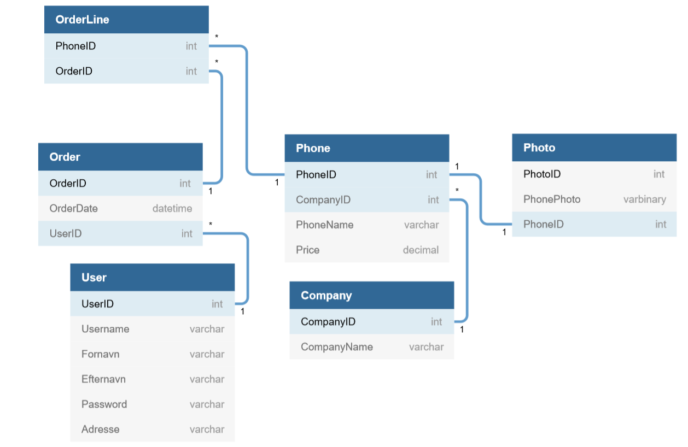
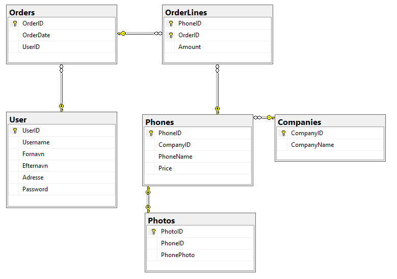

# eShop Projektet

## Hvilken slags eShop skal projektet være?

Jeg har valgt at i min eShop vil jeg sælge Telefoner.
Med billeder af selve telefonen, mærke, og hvilket firma der har lavet selve telefonen.

## ER Diagram

ER Diagrammet består af 3 tabeller (*Indtil videre*).
>**Company** hvem har lavet telefonen, hvilket firma.
>
>**Phone** selve telefonen, med navn, pris, photo, og firmanavnet-
>
>**Photo** billederne af telefonerne.
>
>**OrderLine og Order** når brugeren skal afslutte købet bliver inkøbskurven gemt i *Order*

#### En til Mange
Grunden til at der er en **En til Mange** relation mellem *Company* og *Phone* er fordi
et firma (*Company*) kan ha lavet mange telfoner (*Phone*), men en telefon kan kun blive produceret
af et firma.
>Phone - Company

#### Mange til Mange
For at lave en **Mange til Mange** relation skal der være en tabel imellem de to tabeller hvor
relationen skal være, i dette tilfælde har jeg sat *OrderLine* imellem *Order* og *Phone*,
og imellem *OrderLine* - *Order* og *OrderLine* og *Phone* er der lavet en **En til Mange** relation,
som mellem *Phone* og *Compamy*.

#### En til En
Imellem *Phone* og *Photo* har jeg valgt at lave en **En til En** relation, dvs. hver telefon kan 
kun have *et* *Photo*.

## DataBase Diagram

